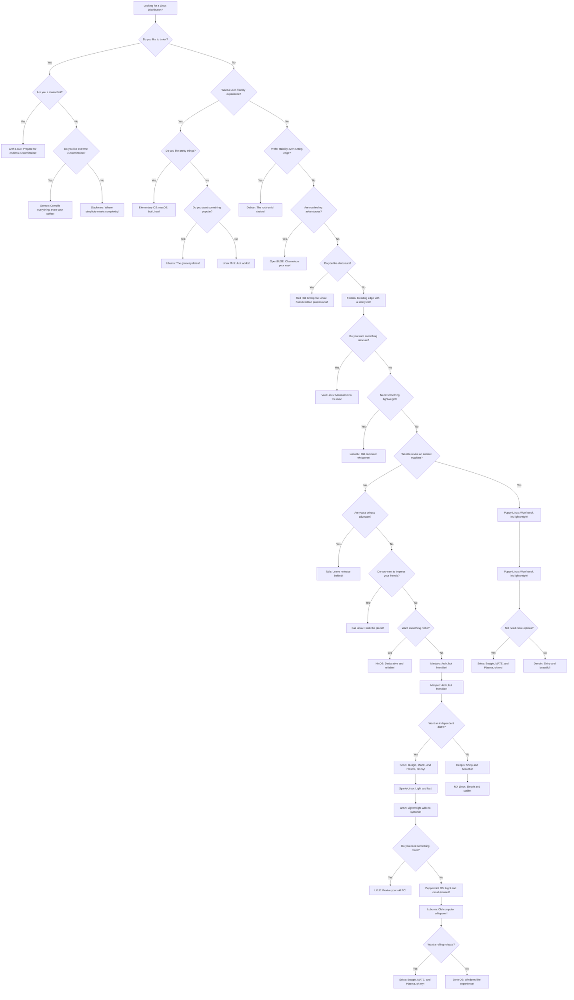

# 🦸‍♂️ Herox Linux

Welcome to the **Herox Linux** repository! This is where coding meets heroism, and the adventures of our fearless OS, Linux, take center stage. Below, you'll find all the essential details about this project, sprinkled with some humor and GitHub Easter eggs. Enjoy! 😄


## Table of Contents

- [Introduction](#introduction)
- [Features](#features)
- [Getting Started](#getting-started)
- [Contributing](#contributing)
- [License](#license)

## Introduction

Meet Linus Torvald, the hero we never knew we needed. When he's not busy developing operating systems, he's saving the world from bugs and crashes. This project showcases his extraordinary skills and the tools he uses to keep our digital world safe.

## Features

- 🐱‍💻 **Coding Mastery**: Witness the unmatched prowess of Linux in coding.
- 🛠️ **Toolbelt**: Explore the powerful tools used on Linux.
- 🐛 **Bug Squashing**: See Linux in action.

## Choose_your_distribution 


## Getting Started

To get started with this project, follow these simple steps:

1. Clone the repo:
   ```sh
   git clone https://github.com/your-username/herox-linus-torvald.git
   ```
2. Navigate to the project directory:
   ```sh
   cd herox-linus-torvald
   ```
3. Open it:
   ```sh
   nvim .
   ```

Watch as Linus performs his coding magic!

## Contributing

Contributions are welcome! If you have ideas to make Linux even more heroic, feel free to fork the repo and submit a pull request.

## License

Distributed under the MIT License. See `LICENSE` for more information.

---

*This README is dedicated to Linux. Thank you for making our digital lives better!*
